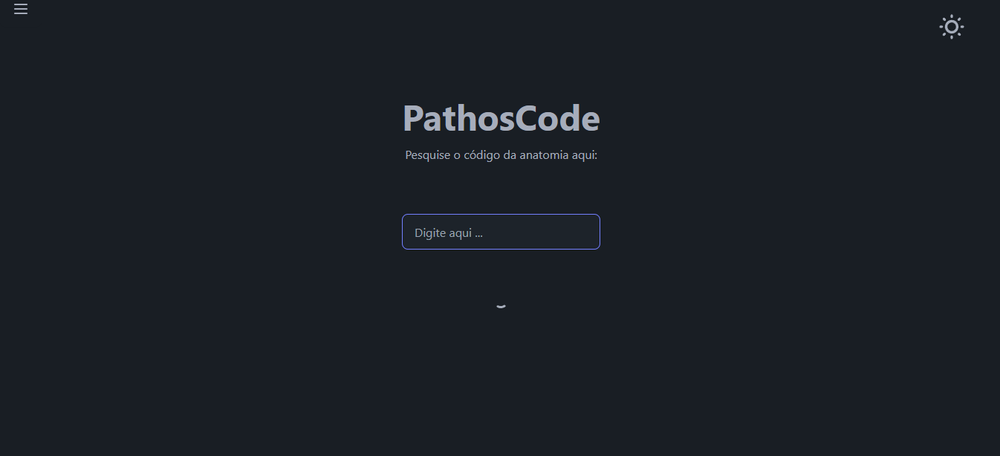

# PathosCode

PathosCode é um aplicativo desenvolvido para a pesquisa de códigos de anatomia patológica. Criado por Marcelo Soares, este projeto foi desenvolvido como um trabalho freelancer para uma clínica médica. O aplicativo permite aos usuários pesquisar códigos de amostras e anatomia patológica de forma eficiente.



## Deploy

O projeto está implantado e pode ser acessado no seguinte link:

[PathosCode Deploy](https://pathoscode.vercel.app)

## Funcionalidades

- **Pesquisa de Códigos de Anatomia Patológica:** Permite aos usuários pesquisar e visualizar códigos de anatomia patológica.
- **Temas:** Usuários podem alternar entre temas dark e light para melhor adaptação.
- **Gestão de Amostras:** Admins podem criar, editar e excluir amostras.
- **Gestão de Anatomias:** Admins podem criar, editar e excluir registros de anatomia patológica.
- **Autenticação Admin:** Protege funcionalidades sensíveis com autenticação baseada em tokens.
- **Interface Responsiva:** Interface amigável e responsiva, adaptada para diversos dispositivos.

## Tecnologias Utilizadas

- **Next.js:** Framework React para a construção de interfaces de usuário.
- **NextAPI:** Para a criação das APIs do lado do servidor.
- **PostgreSQL:** Banco de dados utilizado para armazenar informações das amostras e anatomias patológicas.

## Como Iniciar

### Pré-requisitos

- Node.js instalado
- PostgreSQL instalado e em execução

### Configuração do Banco de Dados

1. Crie um banco de dados PostgreSQL.
2. Configure as variáveis de ambiente no arquivo `.env` com as credenciais do seu banco de dados PostgreSQL.

### Variáveis de Ambiente

Crie um arquivo `.env` na raiz do projeto e adicione as seguintes variáveis:

```env
DATABASE_URL=postgres://<usuário>:<senha>@<host>:<porta>/<nome_do_banco>
NEXT_PUBLIC_API_URL=http://localhost:3000/api
SECRET_KEY_ADMIN=<sua_chave_secreta_admin>
```

### Instalação

1. Clone o repositório:

   ```sh
   git clone https://github.com/Marcelo-Soares-codes/PathosCode.git
   ```

2. Navegue até o diretório do projeto:

   ```sh
   cd pathoscode
   ```

3. Instale as dependências:

   ```sh
   npm install
   ```

### Executando a Aplicação

1. Execute as migrações do banco de dados para criar as tabelas necessárias:

   ```sh
   npx prisma migrate dev
   ```

2. Inicie a aplicação em ambiente de desenvolvimento:

   ```sh
   npm run dev
   ```

   O aplicativo estará disponível em `http://localhost:3000`.

## Licença

Este projeto foi desenvolvido por Marcelo Soares. O uso deste software é restrito à clínica médica para a qual foi desenvolvido. A revenda ou redistribuição por terceiros é proibida sem permissão expressa do autor. Para mais detalhes, consulte o arquivo [LICENSE.txt](./LICENSE.txt).

---

© 2023 Marcelo Soares. Todos os direitos reservados.
